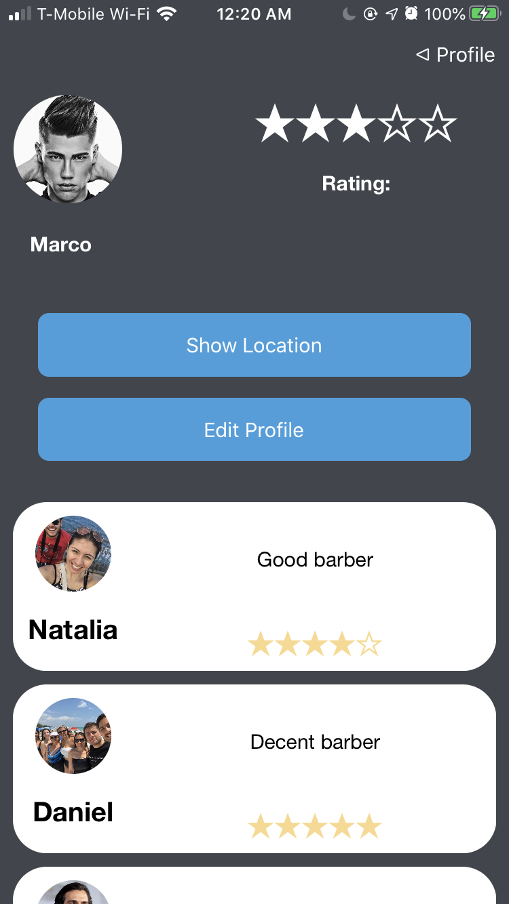
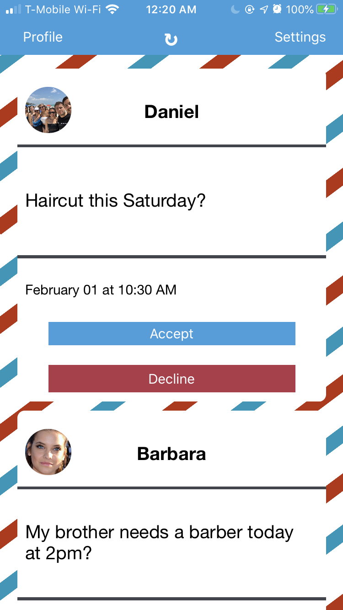

# Stilista
An iOS application to search for hair stylists and to search for clients.

### Why I created the App?

Stilista compares your location with nearby users to create a list of hair stylists that are filtered by the distance you choose. 
Stilista also shows the exact location of the stylist that you wish to meet and allows you request an appointment. 
A user can sign up as a client or a hair stylist. After an appointment clients can also leave reviews on hair stylists. *Note Map-Kit does not work at all in the iPhone simulator.

## Technologies: 
1. MapKit
2. Firebase Storage
3. Heroku
4. KingFisher
5. Passport.js
6. Cookie-storage
7. Cookie-parser
8. Body-parser
9. MongoDB
10. Mongoose
11. Node.js
12. Express
13. Bcrypt.js
14. Passport.js

## Languages: 
1. Swift

#### What can the app do?
1. The app can authenticate users as clients or hair stylists
2. Allow clients to locate nearby hair stylists and check their reviews.
3. Allow clients to post and delete reviews.
4. Allow stylists to accept and decline jobs.
5. A rating system for stylists.
6. Users can upload profile pictures.
7. Shows the exact location of the stylists in MapKit

#### Below are some screenshots of the app

    
    
    
 
    

    
